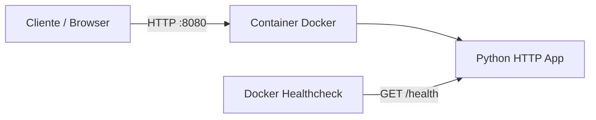

# 🐳 Lab 02 — Docker App

Laboratório prático de containerização de uma aplicação HTTP simples em Python.

O objetivo é sair do conceito e praticar **build, execução, healthcheck e boas práticas básicas de segurança em containers**.

## 🎯 O que este lab pratica

- criação de `Dockerfile`;
- build de imagem;
- publicação de porta;
- variáveis de ambiente;
- `HEALTHCHECK`;
- execução com usuário não-root;
- imagem base enxuta;
- `.dockerignore`;
- execução com Docker Compose;
- `read_only`, `cap_drop` e `no-new-privileges` no Compose;
- inspeção de logs e estado do container.

## 🧱 Arquitetura



A aplicação expõe dois endpoints:

| Endpoint | Função |
|---|---|
| `/` | Retorna informações do serviço |
| `/health` | Retorna o estado de saúde do container |

## 📁 Estrutura

```text
02-docker-app/
├── app.py
├── Dockerfile
├── docker-compose.yml
├── .dockerignore
└── README.md
```

## ✅ Pré-requisitos

- Docker Desktop ou Docker Engine;
- Docker Compose v2 (`docker compose`).

A aplicação usa apenas a biblioteca padrão do Python. Não existe arquivo de dependências externas.

---

## 1. Build da imagem

Entre na pasta do laboratório:

```powershell
cd labs/02-docker-app
```

Crie a imagem:

```powershell
docker build -t devops-docker-lab:1.0 .
```

Confira:

```powershell
docker image ls devops-docker-lab
```

---

## 2. Executar com Docker

```powershell
docker run -d --rm `
  --name devops-docker-lab `
  -p 8080:8080 `
  -e APP_ENV=docker `
  devops-docker-lab:1.0
```

### Testar a aplicação

```powershell
Invoke-RestMethod http://localhost:8080/
```

Resultado esperado:

```text
service         : devops-docker-lab
status          : running
environment     : docker
health_endpoint : /health
```

### Testar health endpoint

```powershell
Invoke-RestMethod http://localhost:8080/health
```

Resultado esperado:

```text
status : healthy
```

---

## 3. Verificar o healthcheck do Docker

```powershell
docker ps
```

Após alguns segundos, a coluna `STATUS` deve apresentar algo semelhante a:

```text
Up ... (healthy)
```

Para inspecionar diretamente:

```powershell
docker inspect --format='{{json .State.Health}}' devops-docker-lab
```

---

## 4. Logs

```powershell
docker logs -f devops-docker-lab
```

Interrompa a visualização com `Ctrl + C`.

---

## 5. Parar o container

```powershell
docker stop devops-docker-lab
```

Como foi usado `--rm`, o container é removido automaticamente após a parada.

---

## 6. Executar com Docker Compose

```powershell
docker compose up --build -d
```

Validar:

```powershell
docker compose ps
Invoke-RestMethod http://localhost:8080/health
```

Ver logs:

```powershell
docker compose logs -f
```

Parar e remover os recursos:

```powershell
docker compose down
```

---

## 🔐 Boas práticas aplicadas

### Usuário não-root

O processo da aplicação roda como UID/GID `10001`, não como `root`.

### Imagem enxuta

A base utilizada é `python:3.13-slim`, reduzindo componentes desnecessários em comparação com imagens Python completas.

### Sem dependências desnecessárias

O healthcheck utiliza `urllib` da própria biblioteca padrão do Python. Não é necessário instalar `curl` apenas para verificar saúde.

### Filesystem somente leitura no Compose

```yaml
read_only: true
```

A aplicação não precisa alterar arquivos durante a execução.

### Capabilities removidas

```yaml
cap_drop:
  - ALL
```

O serviço não depende de capabilities Linux adicionais.

### Bloqueio de elevação de privilégio

```yaml
security_opt:
  - no-new-privileges:true
```

---

## 🧪 Desafios opcionais

Depois de concluir o fluxo básico:

- alterar `APP_ENV` e validar a resposta;
- trocar a porta publicada de `8080` para `8081`;
- inspecionar camadas com `docker history devops-docker-lab:1.0`;
- executar `docker stats` e observar consumo;
- comparar o tamanho da imagem com uma imagem Python não-slim.

## 🧹 Limpeza

Se quiser remover a imagem criada:

```powershell
docker image rm devops-docker-lab:1.0
```

## ✅ Critério de conclusão

O lab está concluído quando você consegue:

1. construir a imagem sem erros;
2. iniciar o container;
3. acessar `/`;
4. receber `healthy` em `/health`;
5. ver o container como saudável no Docker;
6. iniciar e encerrar o mesmo serviço usando Docker Compose.
