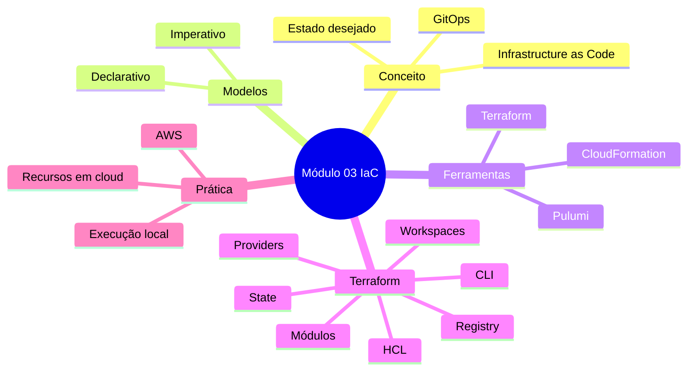

# Módulo 03 — IaC: Infrastructure as Code

> Material de estudo em Markdown sobre o **Módulo 03 — IaC**, baseado nas aulas sobre Infraestrutura como Código, GitOps, modelo declarativo/imperativo, CloudFormation, Pulumi e Terraform.

---

## TL;DR

**IaC**, ou **Infrastructure as Code**, é a prática de criar, alterar e remover infraestrutura usando código.

Em vez de entrar no console da AWS, Azure ou GCP e criar recursos manualmente, você descreve a infraestrutura em arquivos versionados no Git.

Neste módulo, a ideia principal é sair do mundo “manual pelo console” e começar a trabalhar com infraestrutura de forma **declarativa**, **versionada**, **reutilizável** e **automatizável**.

A ferramenta principal escolhida para o módulo é o **Terraform**.

---

## 1. Contexto do módulo

Antes deste módulo, o curso passou por temas como:

- fundamentos de DevOps;
- containers;
- criação de aplicação;
- dockerização;
- redes e volumes no Docker;
- ciclo de vida de containers.

Até esse momento, tudo estava mais voltado para ambiente local.

O Módulo 03 entra em um novo nível: **infraestrutura em nuvem**.

A grande virada é entender como criar recursos de cloud sem depender de cliques manuais no console.

Exemplo:

```text
Antes:
Entrar na AWS → procurar EC2 → clicar em criar instância → configurar tudo manualmente.

Com IaC:
Escrever um arquivo declarando a EC2 → rodar a ferramenta → recurso criado automaticamente na AWS.
```

---

## 2. O que é IaC?

**IaC** significa **Infrastructure as Code**, ou seja, **Infraestrutura como Código**.

Na prática, é usar código para declarar recursos de infraestrutura, como:

- máquinas virtuais;
- redes;
- filas;
- buckets de armazenamento;
- bancos de dados;
- clusters Kubernetes;
- balanceadores de carga;
- permissões;
- serviços de cloud em geral.

A ideia é simples:

```text
A infraestrutura deixa de ser algo criado manualmente
                ↓
e passa a ser algo descrito, versionado e reproduzível via código.
```

---

## 3. Qual problema o IaC resolve?

Sem IaC, é comum acontecer:

- recurso criado manualmente e esquecido;
- cobrança desnecessária na cloud;
- recurso duplicado;
- falta de rastreabilidade;
- dificuldade para saber quem alterou o quê;
- ambientes diferentes entre desenvolvimento, homologação e produção;
- risco de alguém alterar algo no console e quebrar outro time;
- dificuldade para recriar uma infraestrutura do zero.

Com IaC, a infraestrutura passa a ter:

- histórico;
- versionamento;
- padronização;
- revisão por Pull Request;
- automação;
- previsibilidade;
- melhor controle de custos;
- fonte única da verdade.

---

## 4. Exemplo simples de IaC

Imagine que você precisa criar uma máquina virtual na AWS.

### Sem IaC

Você faria manualmente:

```text
AWS Console → EC2 → Launch Instance → escolhe imagem → escolhe tipo → rede → storage → criar.
```

Funciona? Sim.

Mas não é escalável para empresa, time ou ambiente profissional.

### Com IaC

Você escreveria um arquivo descrevendo o recurso desejado:

```hcl
resource "aws_instance" "app" {
  ami           = "ami-exemplo"
  instance_type = "t2.micro"

  tags = {
    Name = "app-server"
  }
}
```

Depois a ferramenta cria isso na AWS.

O foco não é clicar. O foco é **declarar o estado desejado**.

---

## 5. Conceito central: estado desejado

O IaC trabalha com a ideia de **estado**.

Você escreve como quer que a infraestrutura esteja.

Exemplo:

```text
Quero uma EC2 t2.micro chamada app-server.
```

A ferramenta compara:

```text
Estado declarado no código
        vs
Estado real na cloud
```

Se algo estiver diferente, ela tenta ajustar a infraestrutura para ficar igual ao código.

Essa é a base do modelo declarativo.

---

## 6. GitOps

O módulo também apresenta o conceito de **GitOps**.

GitOps é a junção de:

```text
Git + Operations
```

Ou seja: usar o Git como base para controlar operações de infraestrutura.

A ideia é que a infraestrutura também passe pelo mesmo fluxo usado em desenvolvimento de software:

```text
Código → Commit → Push → Pull Request → Review → Merge → Aplicação da infraestrutura
```

---

## 7. Por que GitOps é importante?

GitOps evita o famoso:

```text
“Vou só alterar rapidinho no console.”
```

Esse tipo de alteração pode funcionar na hora, mas gera problema depois, porque:

- ninguém sabe exatamente o que foi alterado;
- pode quebrar outro time;
- pode criar diferença entre o código e a cloud;
- dificulta rollback;
- dificulta auditoria;
- enfraquece a cultura DevOps.

Com GitOps, qualquer alteração precisa estar no repositório.

Isso gera uma **fonte única da verdade**.

---

## 8. Fluxo prático de IaC com GitOps


Resumo do fluxo:

1. Alguém escreve o código de infraestrutura.
2. O código é versionado no Git.
3. Pode passar por Pull Request e revisão.
4. Uma ferramenta de IaC aplica as mudanças.
5. A cloud passa a refletir o estado declarado no código.

---

## 9. IaC aproxima desenvolvimento e infraestrutura

Um ponto importante do módulo é que IaC aproxima áreas que antes ficavam separadas.

Antes:

```text
Dev cuida da aplicação.
Infra cuida do servidor.
Cada área isolada.
```

Com IaC:

```text
Infra vira código.
Código vai para o Git.
Dev, SRE e Infra conseguem colaborar melhor.
```

Isso é muito alinhado com a cultura DevOps, que busca evitar silos entre áreas.

---

## 10. Modelo declarativo vs modelo imperativo

Esse é um dos pontos mais importantes do módulo.

Existem duas formas principais de pensar automação de infraestrutura:

- modelo declarativo;
- modelo imperativo.

---

## 11. Modelo declarativo

O modelo declarativo foca em **o que precisa existir**.

Você declara o estado desejado e a ferramenta decide como chegar até ele.

Exemplo:

```text
Eu quero uma EC2 com tal imagem, tal tipo de instância e tal nome.
```

Você não precisa escrever cada passo manual.

A ferramenta interpreta o código e cria o recurso.

### Características do modelo declarativo

- foca no estado final;
- descreve o que precisa existir;
- a ferramenta decide como aplicar;
- facilita criação, edição e deleção;
- permite comparar estado atual vs estado desejado;
- funciona muito bem para infraestrutura como código;
- é o modelo usado pelo Terraform.

---

## 12. Modelo imperativo

O modelo imperativo foca em **como fazer**.

Você escreve uma sequência de comandos ou passos.

Exemplo:

```text
1. Criar rede.
2. Criar subnet.
3. Criar security group.
4. Criar instância EC2.
5. Associar EC2 à rede.
```

Aqui a ordem importa muito.

Se você executar fora de ordem, pode quebrar o fluxo.

### Características do modelo imperativo

- foca nos passos;
- descreve como executar;
- geralmente depende de ordem;
- pode ser mais difícil de manter;
- pode exigir scripts longos;
- pode gerar mais complexidade em ambientes grandes.

---

## 13. Comparação direta

| Ponto | Declarativo | Imperativo |
|---|---|---|
| Foco | O que deve existir | Como fazer |
| Exemplo | “Quero uma EC2” | “Execute estes comandos para criar uma EC2” |
| Ordem | A ferramenta resolve boa parte | A ordem costuma importar muito |
| Manutenção | Mais simples em escala | Pode ficar complexa |
| Histórico | Estado versionado | Histórico de comandos/scripts |
| Ferramenta típica | Terraform | Scripts manuais/CLI |

---

## 14. Exemplo visual

```text
DECLARATIVO
“Quero esse estado final.”
        ↓
Ferramenta calcula o caminho.
        ↓
Infra fica igual ao código.

IMPERATIVO
“Faça passo 1, depois passo 2, depois passo 3.”
        ↓
Você controla a sequência.
        ↓
Se errar a ordem, pode dar problema.
```

---

## 15. Cloud Providers citados

O módulo cita vários provedores de cloud que podem ser usados com IaC:

- AWS;
- Azure;
- GCP;
- Oracle Cloud Infrastructure;
- DigitalOcean;
- Alibaba Cloud;
- ambientes on-premise, com limitações.

A AWS aparece como o principal provider usado no módulo.

---

## 16. AWS Free Tier

O módulo recomenda criar uma conta na AWS para acompanhar as práticas.

A AWS possui o conceito de **Free Tier**, que oferece uma cota gratuita para determinados serviços.

Para estudo, isso geralmente é suficiente quando usado com cuidado.

Atenção:

```text
Free Tier não significa “pode sair criando tudo sem olhar”.
```

Você precisa acompanhar:

- serviços criados;
- região usada;
- tempo de execução;
- limites gratuitos;
- recursos esquecidos;
- cobranças inesperadas.

IaC ajuda justamente nisso, porque facilita criar e remover recursos de forma controlada.

---

## 17. Ferramentas apresentadas no módulo

O módulo apresenta algumas ferramentas de IaC:

- CloudFormation;
- Pulumi;
- Terraform;
- Ansible;
- Chef;
- Puppet.

Mas o foco real do módulo será o **Terraform**.

---

# Parte 1 — CloudFormation

## 18. O que é CloudFormation?

O **AWS CloudFormation** é a ferramenta nativa da AWS para infraestrutura como código.

Ela permite criar e gerenciar recursos da AWS usando arquivos declarativos.

Com CloudFormation, você pode criar stacks com recursos como:

- EC2;
- S3;
- VPC;
- IAM;
- RDS;
- Load Balancer;
- outros serviços AWS.

---

## 19. Stack no CloudFormation

No CloudFormation, uma **stack** é um conjunto de recursos gerenciados juntos.

Exemplo:

```text
Stack: app-web
├── EC2
├── Security Group
├── VPC
└── Load Balancer
```

Você declara a stack e o CloudFormation cria esses recursos na AWS.

---

## 20. CloudFormation e CDK

O módulo também cita o conceito de **CDK**, ou **Cloud Development Kit**.

CDK permite escrever infraestrutura usando linguagens de programação, como:

- TypeScript;
- Python;
- Java;
- C#;
- Go.

A ideia é reduzir a curva de aprendizado para quem já programa.

Em vez de escrever apenas YAML/JSON, você pode usar uma linguagem conhecida.

---

## 21. Vantagem do CloudFormation

A principal vantagem é ser uma ferramenta nativa da AWS.

Isso significa:

- integração forte com serviços AWS;
- suporte direto dentro do ecossistema AWS;
- bom para quem trabalha 100% dentro da AWS;
- gerenciamento declarativo de recursos AWS.

---

## 22. Limitação do CloudFormation

O problema principal é o **lock-in**.

CloudFormation funciona apenas na AWS.

Se amanhã você quiser trabalhar com Azure, GCP ou outra cloud, o CloudFormation não resolve.

Você teria que usar outra ferramenta.

Exemplo:

```text
AWS → CloudFormation
Azure → Resource Manager
GCP → Deployment Manager
```

O módulo não escolhe CloudFormation justamente porque ele é muito específico da AWS.

---

## 23. Quando CloudFormation faria sentido?

Faz sentido quando:

- a empresa usa somente AWS;
- o time quer usar ferramenta nativa;
- o lock-in não é um problema;
- há necessidade de integração profunda com serviços AWS;
- a empresa já tem maturidade com CloudFormation.

Mas para um curso mais amplo e com visão multi-cloud, ele não é a melhor escolha principal.

---

# Parte 2 — Pulumi

## 24. O que é Pulumi?

O **Pulumi** é uma ferramenta de IaC que permite criar infraestrutura usando linguagens de programação.

Ele também é primariamente open source, mas possui planos pagos para times e empresas.

O Pulumi facilita a adoção de IaC porque permite usar linguagens como:

- TypeScript;
- Python;
- Go;
- C#;
- Java;
- YAML.

---

## 25. Pulumi e múltiplas clouds

Diferente do CloudFormation, o Pulumi não fica preso apenas à AWS.

Ele possui suporte a vários provedores, como:

- AWS;
- Azure;
- Google Cloud;
- Alibaba Cloud;
- DigitalOcean;
- DataDog;
- outros serviços e providers.

Isso torna o Pulumi uma ferramenta mais flexível.

---

## 26. Por que Pulumi chama atenção?

Porque ele permite escrever infraestrutura usando uma linguagem que você já conhece.

Exemplo:

```text
Se você já trabalha com Python,
pode escrever IaC em Python.

Se você trabalha com TypeScript,
pode escrever IaC em TypeScript.
```

Isso reduz a curva de aprendizado.

---

## 27. Exemplo conceitual com Pulumi

Se você quisesse criar uma instância EC2, no Pulumi você poderia escrever usando uma linguagem como TypeScript ou Python.

A lógica seria parecida com:

```text
Importar biblioteca da AWS
Definir imagem da máquina
Definir tipo da instância
Definir tags
Executar o deploy
```

A infraestrutura seria criada no provedor de cloud.

---

## 28. Pulumi e credenciais

Para o Pulumi se comunicar com a cloud, ele precisa de credenciais.

No caso da AWS, normalmente você configura:

- Access Key;
- Secret Key;
- região;
- perfil de autenticação.

Isso permite que a ferramenta crie recursos em seu nome.

---

## 29. Ambientes com Pulumi

O módulo cita a importância de ter ambientes separados, como:

- desenvolvimento;
- homologação/staging;
- produção.

O IaC ajuda muito nisso, porque você consegue replicar ambientes parecidos com mais facilidade.

Exemplo:

```text
Mesmo código base
        ↓
Variáveis diferentes
        ↓
Ambiente dev, hmg e prod parecidos
```

---

## 30. Por que o curso não usa Pulumi?

O módulo cita alguns motivos para não seguir com Pulumi:

- limitações em alguns cenários de gerenciamento;
- planos pagos para uso em time;
- menor popularidade comparado ao Terraform;
- escolha por uma ferramenta mais dominante no mercado.

Pulumi é apresentado como ferramenta importante para conhecer, mas não será a principal do módulo.

---

# Parte 3 — Terraform

## 31. O que é Terraform?

O **Terraform** é uma ferramenta de automação de infraestrutura.

Ele é open source, mantido pela HashiCorp e pela comunidade.

É uma das ferramentas mais populares do mercado para IaC.

Com Terraform, você consegue declarar recursos de infraestrutura e aplicá-los em diferentes provedores.

---

## 32. HashiCorp

A HashiCorp é citada no módulo como uma empresa importante no ecossistema de automação de infraestrutura.

Além do Terraform, ela possui outras ferramentas conhecidas:

- Consul;
- Vault;
- Nomad;
- Terraform.

Resumo rápido:

| Ferramenta | Ideia principal |
|---|---|
| Terraform | Criar e gerenciar infraestrutura como código |
| Vault | Gerenciar segredos e credenciais |
| Consul | Service discovery e networking |
| Nomad | Orquestração de workloads, concorrente em alguns cenários do Kubernetes |

---

## 33. Por que Terraform foi escolhido?

O Terraform foi escolhido porque:

- é muito popular;
- tem ampla aceitação no mercado;
- suporta vários providers;
- é declarativo;
- usa arquivos `.tf`;
- possui documentação forte;
- trabalha bem com GitOps;
- é uma base excelente para DevOps e Cloud.

---

## 34. Providers no Terraform

Provider é o plugin que permite o Terraform conversar com uma plataforma.

Exemplos:

- AWS Provider;
- Azure Provider;
- Google Cloud Provider;
- Kubernetes Provider;
- Helm Provider;
- Oracle Cloud Provider;
- DigitalOcean Provider.

Sem provider, o Terraform não sabe com quem ele deve conversar.

Exemplo conceitual:

```text
Terraform + AWS Provider = Terraform consegue criar recursos na AWS.
Terraform + Kubernetes Provider = Terraform consegue criar recursos no Kubernetes.
```

---

## 35. Terraform Registry

O **Terraform Registry** é como um catálogo de providers e módulos.

O módulo compara a ideia com o Docker Hub.

Analogia:

```text
Docker Hub → lugar onde você encontra imagens de containers.
Terraform Registry → lugar onde você encontra providers e módulos de infraestrutura.
```

No Terraform Registry, você encontra providers como:

- AWS;
- Azure;
- GCP;
- Kubernetes;
- Helm;
- DigitalOcean;
- Oracle Cloud;
- Alibaba Cloud.

---

## 36. HCL

Terraform usa por padrão a linguagem **HCL**, que significa:

```text
HashiCorp Configuration Language
```

Ela é usada em arquivos `.tf`.

O HCL lembra um pouco JSON, mas não é JSON.

Exemplo:

```hcl
provider "aws" {
  region = "us-east-1"
}

resource "aws_instance" "example" {
  ami           = "ami-exemplo"
  instance_type = "t2.micro"
}
```

---

## 37. Terraform usa CDK?

Por padrão, não.

Terraform puro trabalha com:

```text
Arquivos .tf + HCL
```

Mas existe o **CDK for Terraform**, que permite trabalhar com linguagens como:

- TypeScript;
- Python;
- Java;
- C#;
- Go.

Mesmo assim, o curso escolhe trabalhar com HCL para entender o funcionamento por baixo dos panos.

---

## 38. Por que aprender HCL direto?

Porque HCL é a base do Terraform.

Aprender HCL ajuda a entender:

- estrutura dos arquivos `.tf`;
- providers;
- resources;
- state;
- módulos;
- workspaces;
- variáveis;
- outputs;
- ciclo de execução do Terraform.

Mesmo que depois você use CDK for Terraform, entender HCL te deixa mais forte tecnicamente.

---

## 39. Estrutura mental do Terraform

Pense assim:

```text
Provider = com quem o Terraform conversa.
Resource = o que o Terraform cria.
State = o que o Terraform sabe que existe.
Module = bloco reutilizável de infraestrutura.
Workspace = separação lógica de ambientes/estados.
Registry = catálogo de providers e módulos.
```

---

## 40. Terraform CLI

Terraform funciona como uma CLI.

Ou seja, você instala e usa pelo terminal.

Comando citado no módulo:

```bash
terraform version
```

Esse comando verifica se o Terraform está instalado e mostra a versão.

No exemplo da aula, foi mostrada uma versão na linha 1.7.

---

## 41. Instalação do Terraform

O módulo cita que o Terraform pode ser instalado em vários sistemas:

- Windows;
- Linux;
- macOS;
- FreeBSD.

No macOS, pode ser instalado com Homebrew.

No Windows, pode ser usado o binário do Terraform.

No Linux, também é possível instalar via gerenciador de pacotes ou binário.

---

## 42. Comandos básicos que você deve conhecer

Mesmo que o módulo ainda esteja no overview, estes são comandos fundamentais do Terraform:

```bash
terraform version
```

Mostra a versão instalada.

```bash
terraform init
```

Inicializa o projeto e baixa os providers.

```bash
terraform plan
```

Mostra o que será criado, alterado ou removido.

```bash
terraform apply
```

Aplica as mudanças na infraestrutura.

```bash
terraform destroy
```

Remove os recursos gerenciados pelo Terraform.

---

## 43. O que é state no Terraform?

O **state** é um dos conceitos mais importantes do Terraform.

Ele representa o estado conhecido da infraestrutura.

O Terraform usa o state para saber:

- quais recursos ele criou;
- quais recursos existem;
- quais atributos esses recursos têm;
- o que precisa mudar;
- o que precisa ser removido.

Sem state, o Terraform não consegue comparar bem o código com o ambiente real.

---

## 44. Exemplo de raciocínio do state

Imagine que seu código diz:

```text
Quero uma EC2 t2.micro.
```

E no state consta:

```text
Existe uma EC2 t2.micro.
```

Então o Terraform entende:

```text
Nada para mudar.
```

Agora imagine que você altera o código:

```text
Quero uma EC2 t3.micro.
```

O Terraform compara com o state e percebe:

```text
Preciso alterar a instância.
```

---

## 45. Criação, alteração e remoção

IaC gerencia o ciclo de vida completo da infraestrutura:

```text
Criar → Alterar → Remover
```

Exemplo:

```text
Criar: declarar uma EC2 nova.
Alterar: mudar tipo da instância.
Remover: apagar o bloco do recurso ou executar destroy.
```

A ferramenta usa o estado para decidir o que fazer.

---

## 46. Por que não criar tudo pelo console?

Criar pelo console até funciona para testes rápidos, mas não é uma boa prática em ambientes profissionais.

Problemas do console:

- pouca rastreabilidade;
- alterações manuais difíceis de auditar;
- risco de erro humano;
- duplicidade de recursos;
- ambientes inconsistentes;
- dificuldade para replicar infraestrutura;
- dificuldade para desfazer mudanças;
- risco de custos esquecidos.

Com IaC, o console deixa de ser o lugar principal de mudança.

O repositório passa a ser a fonte principal.

---

## 47. IaC e custos

IaC também ajuda no controle de custos.

Como os recursos estão declarados em código, fica mais fácil saber:

- o que existe;
- por que existe;
- quem criou;
- quando foi alterado;
- se pode ser removido.

Isso evita aquele cenário clássico:

```text
Criei uma máquina para testar e esqueci ligada.
```

---

## 48. IaC e ambientes parecidos

Em cloud, é importante ter ambientes como:

- dev;
- staging/homologação;
- produção.

IaC ajuda a manter esses ambientes parecidos.

Exemplo:

```text
Mesmo módulo Terraform
        ↓
Variáveis diferentes
        ↓
Ambientes separados
```

Isso reduz bugs do tipo:

```text
“Na minha máquina funciona.”
“Em homologação funciona.”
“Em produção quebrou.”
```

---

## 49. Responsabilidade no fluxo IaC

Em um time real, o fluxo pode envolver:

- pessoa desenvolvedora;
- SRE;
- engenheiro DevOps;
- time de infraestrutura;
- time de segurança;
- revisão por pares;
- pipeline de CI/CD.

No módulo atual, o foco é trabalhar mais localmente.

No módulo seguinte, a ideia é evoluir para CI/CD e pipelines de infraestrutura.

---

## 50. Segurança em IaC

Mesmo que o módulo esteja focado no conceito inicial, é importante lembrar:

IaC mexe com infraestrutura real.

Então alguns cuidados são obrigatórios:

- não commitar Access Key;
- não commitar Secret Key;
- usar variáveis de ambiente;
- usar secret manager quando possível;
- revisar permissões IAM;
- aplicar menor privilégio;
- revisar o `terraform plan` antes do `apply`;
- evitar executar `destroy` sem conferir;
- separar ambientes.

---

## 51. Comparação das ferramentas

| Ferramenta | Multi-cloud | Linguagem principal | Ponto forte | Limitação citada |
|---|---:|---|---|---|
| CloudFormation | Não | YAML/JSON/CDK | Nativo AWS | Lock-in na AWS |
| Pulumi | Sim | TypeScript, Python, Go, C#, Java, YAML | Usa linguagens conhecidas | Limitações/plano para times/popularidade menor |
| Terraform | Sim | HCL | Popular, amplo, forte no mercado | Curva cognitiva e necessidade de entender state/HCL |
| Ansible | Parcial | YAML | Automação/configuração | Não é o foco do módulo |
| Chef | Parcial | Ruby DSL | Configuração de servidores | Não é o foco do módulo |
| Puppet | Parcial | DSL própria | Configuração de servidores | Não é o foco do módulo |

---

## 52. Ordem de aprendizado do módulo



---

## 53. Mapa mental rápido

```text
IaC
├── Infraestrutura como código
├── Resolve criação manual no console
├── Trabalha com estado desejado
├── Usa Git como fonte da verdade
├── Aproxima Dev + Infra + SRE
├── Ajuda em criação, alteração e remoção
├── Evita duplicidade e falta de rastreio
├── Ferramentas
│   ├── CloudFormation
│   ├── Pulumi
│   └── Terraform
└── Terraform
    ├── HCL
    ├── .tf
    ├── Providers
    ├── Registry
    ├── State
    ├── Modules
    └── Workspaces
```

---

## 54. Glossário do módulo

| Termo | Significado |
|---|---|
| IaC | Infrastructure as Code, infraestrutura como código |
| Cloud Provider | Provedor de nuvem, como AWS, Azure ou GCP |
| GitOps | Uso do Git para controlar operações e infraestrutura |
| SCM | Source Code Management, controle de versão de código |
| Pull Request | Solicitação de alteração para revisão antes de merge |
| State | Estado conhecido da infraestrutura |
| Declarativo | Modelo que descreve o que deve existir |
| Imperativo | Modelo que descreve como executar passos |
| Provider | Plugin que conecta Terraform a uma plataforma |
| Resource | Recurso criado pelo Terraform |
| Module | Conjunto reutilizável de código Terraform |
| Workspace | Separação lógica de estados/ambientes |
| HCL | HashiCorp Configuration Language |
| CDK | Cloud Development Kit |
| Lock-in | Dependência forte de uma tecnologia ou fornecedor |
| EC2 | Serviço de máquina virtual da AWS |
| Free Tier | Cota gratuita de uso em determinados serviços AWS |

---

## 55. Pontos que mais caem em prova/entrevista

### O que é IaC?

É a prática de gerenciar infraestrutura usando código, permitindo versionamento, automação e reprodutibilidade.

### Por que IaC é melhor que criar no console?

Porque dá rastreabilidade, histórico, padronização, revisão e evita alterações manuais sem controle.

### O que é GitOps?

É usar o Git como fonte da verdade para operações e infraestrutura.

### Declarativo vs imperativo

Declarativo diz **o que deve existir**.

Imperativo diz **como fazer**.

### Por que CloudFormation não foi escolhido?

Porque é exclusivo da AWS e pode gerar lock-in.

### Por que Pulumi não foi escolhido?

Porque apesar de ser interessante e multi-cloud, o módulo opta por uma ferramenta mais popular e dominante no mercado.

### Por que Terraform foi escolhido?

Porque é popular, multi-cloud, declarativo, extensível por providers e muito usado no mercado.

---

## 56. Checklist de revisão

Use este checklist para revisar o módulo:

- [ ] Sei explicar o que é IaC.
- [ ] Sei explicar por que criar recurso manualmente no console não escala bem.
- [ ] Entendi o conceito de GitOps.
- [ ] Sei diferenciar modelo declarativo e imperativo.
- [ ] Sei o que é CloudFormation.
- [ ] Sei por que CloudFormation gera lock-in na AWS.
- [ ] Sei o que é Pulumi.
- [ ] Sei por que Pulumi usa linguagens como Python e TypeScript.
- [ ] Sei por que o módulo escolhe Terraform.
- [ ] Sei o que é Terraform Registry.
- [ ] Sei o que é provider.
- [ ] Sei o que é HCL.
- [ ] Sei o que é um arquivo `.tf`.
- [ ] Sei para que serve o Terraform CLI.
- [ ] Sei o comando `terraform version`.
- [ ] Tenho noção dos comandos `init`, `plan`, `apply` e `destroy`.
- [ ] Entendi que state é essencial no Terraform.
- [ ] Entendi que o próximo passo será aprofundar em Terraform.

---

## 57. Resumo final em 4 linhas

IaC é a prática de controlar infraestrutura usando código, evitando criação manual e bagunça no console.

GitOps usa o Git como fonte da verdade para versionar, revisar e aplicar mudanças de infraestrutura.

O módulo apresenta CloudFormation e Pulumi, mas escolhe Terraform por ser mais popular, flexível e multi-cloud.

Terraform usa HCL, providers, registry, state e CLI para criar, alterar e remover recursos de forma declarativa.

---

## 58. Frase para memorizar

```text
IaC é transformar infraestrutura em código versionado.
Terraform é a ferramenta que aplica esse código na cloud.
GitOps é o processo que mantém tudo rastreável pelo Git.
```
